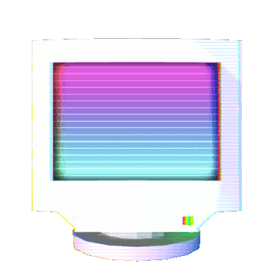

<!-- Begin Header -->
<details open>
  <summary>
    <code>
      About Me
    </code>
  </summary>
  

  ```diff
  hi, im michael 👨🏻‍💻

  @@developer@@
  + 22 years old
  - based in toronto, canada
  ! web dev, full-stack, and data science
  🎓 computer science @ carleton university
  diff "i haven't failed, i’ve just found 10,000 ways that won’t work"
  ```
</details>
<br/>
<!-- End Header -->
<!-- Begin GitHub Stats -->
<details open>
  <summary>
    <code>
      GitHub Stats
    </code>
  </summary>
  <br/>
  <a href="https://github.com/anuraghazra/github-readme-stats">
    
  </a>
  <a href="https://github.com/anuraghazra/github-readme-stats">
    
  </a>
  <br/>
</details>
<br/>
<!-- End GitHub Stats -->
<!-- Start Profile Views -->

<div align="right">
  
</div>
<div align="right">
    
    
    
</div>


<!-- End Profile Views -->
