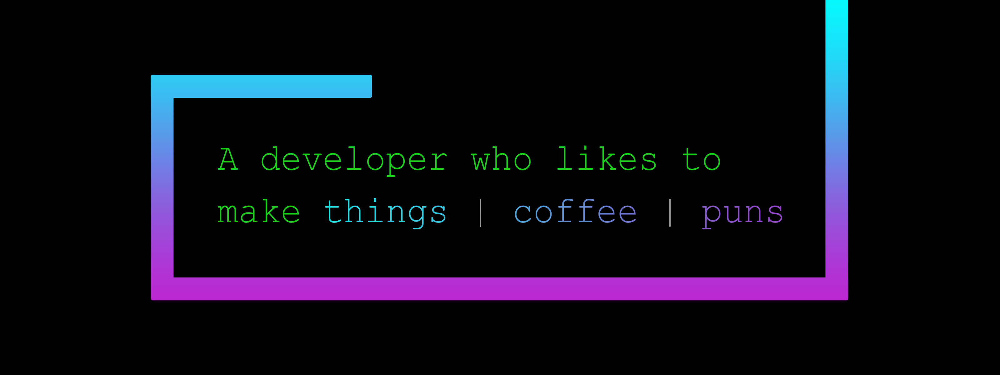

<!-- Begin Banner -->
<details open>
  <summary>
    <code>&lt;banner&gt;</code>
  </summary>
  <br/>
  
</details>
<!-- End Banner -->
<br>
<!-- Begin Header -->
<details open>
  <summary>
    <code>&lt;about me&gt;</code>
  </summary>
  

  ```diff
  hi, im michael 👨🏻‍💻

  @@developer@@
  + 24 years old
  - based in toronto, canada
  ! web dev, full-stack, and data science
  🎓 computer science grad @ carleton university
  diff "i haven't failed, i’ve just found 10,000 ways that won’t work"
  ```
</details>
<!-- End Header -->
<br>
<!-- Begin GitHub Stats -->
<details open>
  <summary>
    <code>&lt;github stats&gt;</code>
  </summary>
  <br/>
  <a href="https://github.com/anuraghazra/github-readme-stats">
    
  </a>
  <a href="https://github.com/anuraghazra/github-readme-stats">
    
  </a>
</details>
<!-- End GitHub Stats -->
<br>
<!-- Start Technologies -->
<details open>
  <summary>
    <code>&lt;technologies&gt;</code>
  </summary>
  <br>
  <table>
  <tr>
    <th>Type</th>
    <th>Tech</th>
  </tr>
  <tr>
    <td>Front-End</td>
    <td>
      <a href="https://www.javascript.com/">
        
      </a>
      <a href="https://html.spec.whatwg.org/multipage/">
        
      </a>
      <a href="https://www.w3.org/Style/CSS/">
        
      </a>
      <a href="https://reactjs.org/">
        
      </a>
      <a href="https://redux.js.org/">
        
      </a>
      <a href="https://nodejs.org/">
        
      </a>
      <a href="https://www.typescriptlang.org/">
        
      </a>
      <a href="https://sass-lang.com/">
        
      </a>
      <a href="https://next.material-ui.com/">
        
      </a>
      <a href="https://getbootstrap.com/">
        
      </a>
      <a href="https://nextjs.org/">
        
      </a>
    </td>
  </tr>
  <tr>
    <td>Back-End</td>
    <td>
      <a href="https://www.python.org/">
        
      </a>
      <a href="https://www.djangoproject.com/">
        
      </a>
      <a href="https://www.java.com/">
        
      </a>
      <a href="https://spring.io/">
        
      </a>
      <a href="http://www.open-std.org/JTC1/SC22/WG14/">
        
      </a>      
      <a href="http://www.open-std.org/JTC1/SC22/WG21/">
        
      </a>
    </td>
  </tr>
  <tr>
    <td>Data Science</td>
    <td>
      <a href="https://www.tensorflow.org/">
        
      </a>
      <a href="https://jupyter.org/">
        
      </a>
      <a href="https://opencv.org/">
        
      </a>
      <a href="https://scikit-learn.org/">
        
      </a>
    </td>
  </tr>
  <tr>
    <td>Databases</td>
    <td>
      <a href="https://www.mongodb.com/">
        
      </a>
      <a href="https://www.mysql.com/">
        
      </a>
      <a href="https://aws.amazon.com/s3/">
        
      </a>
    </td>
  </tr>
  <tr>
    <td>Cloud</td>
    <td>
      <a href="https://cloud.google.com/">
        
      </a>
      <a href="https://aws.amazon.com/">
        
      </a>
      <a href="https://azure.microsoft.com/">
        
      </a>
      <a href="https://www.docker.com/">
        
      </a>
    </td>
  </tr>
  <tr>
    <td>Operating Systems</td>
    <td>
      <a href="https://www.apple.com/macos/">
        
      </a>
      <a href="https://www.linux.org/">
        
      </a>
      <a href="https://ubuntu.com/">
        
      </a>
      <a href="https://www.microsoft.com/en-ca/windows">
        
      </a>
    </td>
  </tr>
  <tr>
    <td>Version Control</td>
    <td>
      <a href="https://git-scm.com/">
        
      </a>
      <a href="https://github.com/">
        
      </a>
      <a href="https://about.gitlab.com/">
        
      </a>
      <a href="https://bitbucket.org/">
        
      </a>      
    </td>
  </tr>
  <tr>
    <td>Misc</td>
    <td>
      <a href="https://code.visualstudio.com/">
        
      </a>
      <a href="https://www.gnu.org/software/bash/">
        
      </a>
      <a href="https://www.atlassian.com/software/confluence">
        
      </a>
      <a href="https://docs.microsoft.com/en-us/powershell/">
        
      </a>
      <a href="https://www.npmjs.com/">
        
      </a>
    </td>
  </tr>
</table>
</details>
<!-- End Technologies -->
<br>
<!-- Start Spotify -->
<details open>
  <summary>
    <code>&lt;jams&gt;</code>
  </summary>
  <br/>
  <div>
    <a href="https://open.spotify.com/playlist/2mtlhuFVOFMn6Ho3JmrLc2">
      
    </a>
    <a href="https://open.spotify.com/playlist/6tEwsHDqkDzPOL9tmuPuUv">
      
    </a>
    <a href="https://open.spotify.com/playlist/0wZIutZFpaUYYwJJyhkMVG">
      
    </a>
    <a href="https://open.spotify.com/playlist/0a89QvfUATI2oN9VnrZdJr">
              
    </a>
    <a href="https://open.spotify.com/playlist/3POsn2Qb5LcNZukDH3YsEk">
      
    </a>
    <a href="https://open.spotify.com/playlist/6UR7WrfWrOZEkgTNgN3ieg">
            
    </a>
  </div>
  <div>
    
    
  </div>
</details>
<!-- End Spotify -->
<br>
<!-- Start Social Badges -->
<details open>
  <summary>
    <code>&lt;socials&gt;</code>
  </summary>
  <br/>
    <div>
      <a href="https://github.com/michaelkazman">
        
      </a>
      <a href="mailto:michael.kazman@gmail.com">
        
      </a>
      <a href="https://michaelkazman.com">
        
      </a>
      <a href="https://www.linkedin.com/in/michaelkazman/">
        
      </a>
    </div>
    <div>
      <a href="#">
        
      </a>
    </div>
</details>
<!-- End Social Badges -->
<br>
<!-- Start BuyMeACoffee -->
<details open>
  <summary>
    <code>&lt;support&gt;</code>
  </summary>
  <br/>
  <div align="center">
      <a href="https://www.buymeacoffee.com/michaelkazman">
        
      </a>
  </div>
</details>
<!-- End BuyMeACoffee -->
